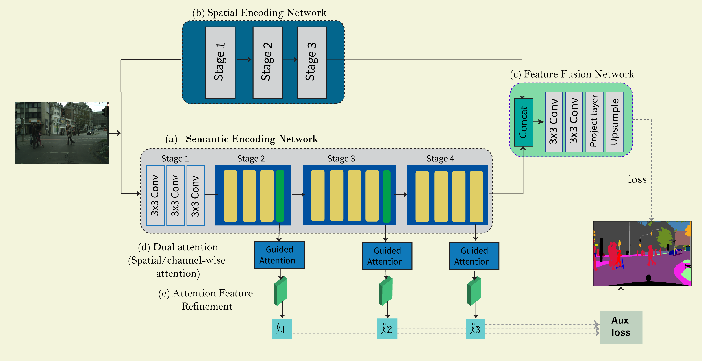

# DSANet: Dilated Spatial Attention for Real-time Semantic Segmentation in Urban Street Scenes

This project contains the Pytorch implementation for the proposed DSANet: [[Expert Systems With Applications]](https://www.sciencedirect.com/science/article/pii/S0957417421005315).

### Introduction

Efficient and accurate semantic segmentation is particularly important in scene understanding for
autonomous driving. Although Deep Convolutional Neural Networks(DCNNs) approaches have
made a significant improvement for semantic segmentation. However, state-of-the-art models such
as Deeplab and PSPNet have complex architectures and high computation complexity. Thus, it is
inefficient for realtime applications. On the other hand, many works compromise the performance to
obtain real-time inference speed which is critical for developing a light network model with high segmentation accuracy. In this paper, we present a computationally efficient network named DSANet,
which follows a two-branch strategy to tackle the problem of real-time semantic segmentation in urban scenes. We first design a Semantic Encoding Branch, which employs channel split and shuffle to reduce the computation and maintain higher segmentation accuracy. Also, we propose a dual attention module consisting of dilated spatial attention and channel attention to make full use of the multi-level feature maps simultaneously, which helps predict the pixel-wise labels in each stage. Meanwhile, Spatial Encoding Network is used to enhance semantic information and preserve the spatial details. To better combine context information and spatial information, we introduce a Simple Feature Fusion Module. We evaluated our model with state-of-the-art semantic image semantic segmentation methods using two challenging datasets. The proposed method achieves an accuracy of 69.9% mean IoU and 71.3% mean IoU at speed of 75.3 fps and 34.08 fps on CamVid and Cityscapes test datasets respectively.

                The detailed architecture of DSANe

<p align="center"></p>

                Dialted Spatial Attention Module

<p align="center"></p>

### Installation

1. Pyroch Environment

- Env: Python 3.6; PyTorch 1.0; CUDA 10.1; cuDNN V8
- Install some packages

```
pip install opencv-python pillow numpy matplotlib
```

1. Clone this repository

```
git clone https://github.com/mohamedac29/DSANet
cd DSANet
```

3. Dataset

You need to download the [Cityscapes](https://www.cityscapes-dataset.com/), and put the files in the `dataset` folder with following structure.

```
├── cityscapes_test_list.txt
├── cityscapes_train_list.txt
├── cityscapes_trainval_list.txt
├── cityscapes_val_list.txt
├── cityscapes_val.txt
├── gtCoarse
│   ├── train
│   ├── train_extra
│   └── val
├── gtFine
│   ├── test
│   ├── train
│   └── val
├── leftImg8bit
│   ├── test
│   ├── train
│   └── val
```

- Convert the dataset to [19 categories](https://github.com/mcordts/cityscapesScripts/blob/master/cityscapesscripts/helpers/labels.py).

- Download the [Camvid](https://github.com/alexgkendall/SegNet-Tutorial/tree/master/CamVid) dataset and put the files in the following structure.

```
├── camvid_test_list.txt
├── camvid_train_list.txt
├── camvid_trainval_list.txt
├── camvid_val_list.txt
├── test
├── testannot
├── train
├── trainannot
├── val
└── valannot

```
### Training 

- Training on Camvid datsaset
```
python train.py --dataset camvid --model DSANet --max_epochs 1000 --train_type trainval --lr 4e-3 --batch_size 8
```
- Training on Camvid datsaset - train_type [trainval,trainval]
```
python train.py --dataset cityscapes --model DSANet --max_epochs 1000 --train_type trainval --lr 4e-3 --batch_size 8
```
### Testing 
- Testing on Camvid datsaset
```
python test.py --dataset camvid --model DSANet --checkpoint ./checkpoint/camvid/DSANetbs8gpu1_trainval/model_150.pth --gpus 0
```
- Testing on Cityscapes datsaset
```
python test.py --dataset cityscapes --model DSANet --checkpoint ./checkpoint/camvid/DSANetbs8gpu1_trainval/model_150.pth --gpus 0
```
### Results

### Inference Speed
- Inference speed with input resolution 512x1024
```
python eval_fps.py 512,1024
```
- Quantitative results:

|     Dataset      |  Pretrained  | Train type |    mIoU    |  FPS  |                                                                    model                                                                     |
| :--------------: | :----------: | :--------: | :--------: | :---: | :------------------------------------------------------------------------------------------------------------------------------------------: |
| Cityscapes(Fine) | from scratch |  trainval  | **71.39%** | 34.08 | [Detailed result](https://www.cityscapes-dataset.com/anonymous-results/?id=a18cd1a0eae4d21c62ac6868b6111d1e5e0d97e0d38e74fce1e64c7379692b30) |
|      CamVid      | from scratch |  trainval  | **69.9%**  | 75.3  |                                                                                                                                              |

- Qualitative segmentation examples on Cityscapes Dataset:

<p align="center"></p>

- Qualitative segmentation examples on Camvid Dataset:

<p align="center"></p>

### Citation

Please consider citing the [DSANet](https://www.sciencedirect.com/science/article/pii/S0957417421005315) if it's helpful for your research.

```
@article{elhassan2021dsanet,
  title={DSANet: Dilated Spatial Attention for Real-time Semantic Segmentation in Urban Street Scenes},
  author={Elhassan, Mohammed AM and Huang, Chenxi and Yang, Chenhui and Munea, Tewodros Legesse},
  journal={Expert Systems with Applications},
  pages={115090},
  year={2021},
  publisher={Elsevier}
}
```

## License

This code is released under the MIT License. See [LICENSE](LICENSE) for additional details.

### Acknowledgment

## Thanks to the Third Party Libs

[DABNet](https://github.com/Reagan1311/DABNet)

[CGNet](https://github.com/wutianyiRosun/CGNet)
